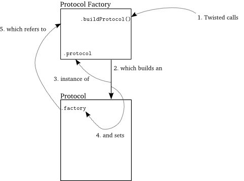
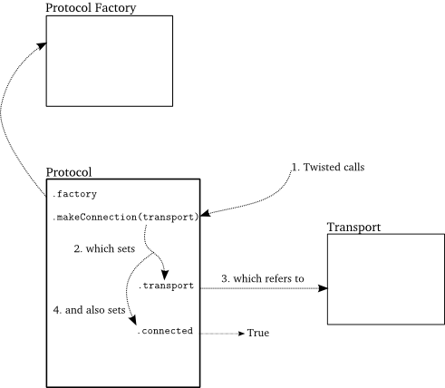
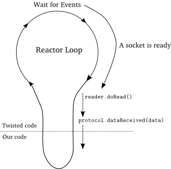

### 抽象地构建客户端

在第四部分中，我们构建了第一个使用Twisted的客户端。它确实能很好地工作，但仍有提高的空间。

首先是，这个客户端竟然有创建网络端口并接收端口处的数据这样枯燥的代码。Twisted理应为我们实现这些例程性功能，省得我们每次写一个新的程序时都要去自己实现。Twisted这样做也将我们从像异步I/O操作中包括许多像异常处理这样的细节处理解放出来。更多的细节处理存在于多平台上运行我们的代码中。如果你那个下午有空，可以翻翻Twisted的WIN32实现源代码，看看里面有多少小针线是来处理跨平台的。

另一问题是与错误处理有关。当运行版本1的Twisted客户端来从并没有提供服务的端口上下载诗歌时，它就会崩溃。我们是可以修正这个错误，但通过下面我们要介绍Twisted的APIs来处理这些类型的错误会更简单。

最后，那个客户端也不能复用。如果有另一个模块需要通过我们的客户端下载诗歌呢？人家怎么知道你的诗歌已经下载完毕？我们不能用一个方法简单地将一首诗下载完成后再传给人家，而在之前让人家处于等待状态。这确实是一个问题，但我们不准备在这个部分解决这个问题—在未来的部分中一定会解决这个问题。

我们将会使用一些高层次的APIs和接口来解决第一、二个问题。Twisted框架是由众多抽象层松散地组合起来的。因此，学习Twisted也就意味着需要学习这些层都提供什么功能，例如每层都有哪些APIs，接口和实例可供使用。接下来我们会通过剖析Twisted最最重要的部分来更好地感受一下Twisted都是怎么组织的。一旦你对Twisted的整个结构熟悉了，学习新的部分会简单多了。

一般来说，每个Twisted的抽象都只与一个特定的概念相关。例如，第四部分中的客户端使用的IReadDescriptor，它就是"一个可以读取字节的文件描述符"的抽象。一个抽象往往会通过定义接口来指定那些想实现个抽象（也就是实现这个接口）对象的形为。在学习新的Twisted抽象概念时，最需要谨记的就是：

> **多数高层次抽象都是在低层次抽象的基础上建立的，很少有另立门户的。**

因此，你在学习新的Twisted抽象概念时，始终要记住它做什么和不做什么。特别是，如果一个早期的抽象A实现了F特性，那么F特性不太可能再由其它任何抽象来实现。另外，如果另外一个抽象需要F特性，那么它会使用A而不是自己再去实现F。（通常的做法，B可能会通过继承A或获得一个指向A实例的引用）

网络非常的复杂，因此Twisted包含很多抽象的概念。通过从低层的抽象讲起，我们希望能更清楚起看到在一个Twisted程序中各个部分是怎么组织起来的。

### 核心的循环体

第一个我们要学习的抽象，也是Twisted中最重要的，就是reactor。在每个通过Twisted搭建起来的程序中心处，不管你这个程序有多少层，总会有一个reactor循环在不停止地驱动程序的运行。再也没有比reactor提供更加基础的支持了。实际上，Twisted的其它部分（即除了reactor循环体）可以这样理解：它们都是来辅助X来更好地使用reactor，这里的X可以是提供Web网页、处理一个数据库查询请求或其它更加具体内容。尽管坚持像上一个客户端一样使用低层APIs是可能的，但如果我们执意那样做，那么我们必需自己来实现非常多的内容。而在更高的层次上，意味着我们可以少写很多代码。

但是当在外层思考与处理问题叶。很容易就忘记了reactor的存在了。在任何一个常见大小的Twisted程序中 ，确实很少会有直接与reactor的APIs交互。低层的抽象也是一样（即我们很少会直接与其交互）。我们在上一个客户端中用到的文件描述符抽象，就被更高层的抽象更好的归纳而至于我们很少会在真正的Twisted程序中遇到。（他们在内部依然在被使用，只是我们看不到而已）

至于文件描述符抽象的消息，这并不是一个问题。让Twisted掌舵异步I/O处理，这样我们就可以更加关注我们实际要解决的问题。但对于reactor不一样，它永远都不会消失。当你选择使用Twisted，也就意味着你选择使用Reactor模式，并且意味着你需要使用回调与多任务合作的"交互式"编程方式。如果你想正确地使用Twisted，你必须牢记reactor的存在。我们将在第六部分更加详细的讲解部分内容。但是现在要强调的是：

> **图5与图6是这个系列中最最重要的图**

我们还将用图来描述新的概念，但这两个图是需要你牢记在脑海中的。可以这样说，我在写Twisted程序时一直想着这两张图。

在我们付诸于代码前，有三个新的概念需要阐述清楚：Transports,Protocols,Protocol Factoies

### Transports

Transports抽象是通过Twisted中interfaces模块中ITransport接口定义的。一个Twisted的Transport代表一个可以收发字节的单条连接。对于我们的诗歌下载客户端而言，就是对一条TCP连接的抽象。但是Twisted也支持诸如Unix中管道和UDP。Transport抽象可以代表任何这样的连接并为其代表的连接处理具体的异步I/O操作细节。

如果你浏览一下ITransport中的方法，可能找不到任何接收数据的方法。这是因为Transports总是在低层完成从连接中异步读取数据的许多细节工作，然后通过回调将数据发给我们。相似的原理，Transport对象的写相关的方法为避免阻塞也不会选择立即写我们要发送的数据。告诉一个Transport要发送数据，只是意味着：尽快将这些数据发送出去，别产生阻塞就行。当然，数据会按照我们提交的顺序发送。

通常我们不会自己实现一个Transport。我们会去实现Twisted提供的类，即在传递给reactor时会为我们创建一个对象实例。

### Protocols

Twisted的Protocols抽象由interfaces模块中的IProtocol定义。也许你已经想到，Protocol对象实现协议内容。也就是说，一个具体的Twisted的Protocol的实现应该对应一个具体网络协议的实现，像FTP、IMAP或其它我们自己规定的协议。我们的诗歌下载协议，正如它表现的那样，就是在连接建立后将所有的诗歌内容全部发送出去并且在发送完毕后关闭连接。

严格意义上讲，每一个Twisted的Protocols类实例都为一个具体的连接提供协议解析。因此我们的程序每建立一条连接（对于服务方就是每接受一条连接），都需要一个协议实例。这就意味着，Protocol实例是存储协议状态与间断性（由于我们是通过异步I/O方式以任意大小来接收数据的）接收并累积数据的地方。

因此，Protocol实例如何得知它为哪条连接服务呢？如果你阅读IProtocol定义会发现一个makeConnection函数。这是一个回调函数，Twisted会在调用它时传递给其一个也是仅有的一个参数，即就是Transport实例。这个Transport实例就代表Protocol将要使用的连接。

Twisted包含很多内置可以实现很多通用协议的Protocol。你可以在[twisted.protocols.basic](http://twistedmatrix.com/trac/browser/trunk/twisted/protocols/basic.py)中找到一些稍微简单点的。在你尝试写新Protocol时，最好是看看Twisted源码是不是已经有现成的存在。如果没有，那实现一个自己的协议是非常好的，正如我们为诗歌下载客户端做的那样。

### Protocol Factories

因此每个连接需要一个自己的Portocol，而且这个Protocol是我们自己定义类的实例。由于我们会将创建连接的工作交给Twisted来完成，Twisted需要一种方式来为一个新的连接制定一个合适的协议。制定协议就是Protocol Factories的 工作了。

也许你已经猜到了，Protocol Factory的API由[IProtocolFactory](http://twistedmatrix.com/trac/browser/trunk/twisted/internet/interfaces.py)来定义，同样在[interfaces](http://twistedmatrix.com/trac/browser/trunk/twisted/internet/interfaces.py)模块中。Protocol Factory就是Factory模式的一个具体实现。buildProtocol方法在每次被调用时返回一个新Protocol实例。它就是Twisted用来为新连接创建新Protocol实例的方法。

### 诗歌下载客户端2.0：第一滴心血

好吧，让我们来看看由Twisted支持的诗歌下载客户端2.0。源码可以在这里[twisted-client-2/get-poetry.py](http://github.com/jdavisp3/twisted-intro/blob/master/twisted-client-2/get-poetry.py)。你可以像前面一样运行它，并得到相同的输出。这也是最后一个在接收到数据时打印其任务的客户端版本了。到现在为止，对于所有Twisted程序都是交替执行任务并处理相对较少数量数据的，应该很清晰了。我们依然通过print函数来展示在关键时刻在进行什么内容，但将来客户端不会在这样繁锁。

在第二个版本中，sockets不会再出现了。我们甚至不需要引入socket模块也不用引用socket对象和文件描述符。取而代之的是，我们告诉reactor来创建到诗歌服务器的连接，代码如下面所示：
```python
factory = PoetryClientFactory(len(addresses))
 
from twisted.internet import reactor
 
for address in addresses:
    host, port = address
    reactor.connectTCP(host, port, factory)
```
我们需要关注的是connectTCP这个函数。前两个参数的含义很明显，不解释了。第三个参数是我们自定义的PoetryClientFactory类的实例对象。这是一个专门针对诗歌下载客户端的Protocol Factory，将它传递给reactor可以让Twisted为我们创建一个PeotryProtocol实例。

值得注意的是，从一开始我们既没有实现Factory也没有去实现Protocol，不像在前面那个客户端中我们去实例化我们PoetrySocket类。我们只是继承了Twisted在twisted.internet.protocol 中提供的基类。Factory的基类是twisted.internet.protocol.Factory，但我们使用客户端专用（即不像服务器端那样监听一个连接，而是主动创建一个连接）的ClientFactory子类来继承。

我们同样利用了Twisted的Factory已经实现了buildProtocol方法这一优势来为我们所用。我们要在子类中调用基类中的实现：
```python
def buildProtocol(self, address):
    proto = ClientFactory.buildProtocol(self, address)
    proto.task_num = self.task_num
    self.task_num += 1
    return proto
```
基类怎么会知道我们要创建什么样的Protocol呢？注意，我们的PoetryClientFactory中有一个protocol类变量：
```python
class PoetryClientFactory(ClientFactory):
 
    task_num = 1
 
    protocol = PoetryProtocol # tell base class what proto to build
```
基类Factory的实现buildProtocol过程是：安装（创建一个实例）我们设置在protocol变量上的Protocol类与在这个实例（此处即PoetryProtocol的实例）的factory属性上设置一个产生它的Factory的引用（此处即实例化PoetryProtocol的PoetryClientFactory）。这个过程如图8所示：

<center></center>
<center>图8 Protocol的生成过程</center>

正如我们提到的那样，位于Protocol对象内的factory属性字段允许在都由同一个factory产生的Protocol之间共享数据。由于Factories都是由用户代码来创建的（即在用户的控制中），因此这个属性也可以实现Protocol对象将数据传递回一开始初始化请求的代码中来，这将在第六部分看到。

值得注意的是，虽然在Protocol中有一个属性指向生成其的Protocol Factory，在Factory中也有一个变量指向一个Protocol类，但通常来说，一个Factory可以生成多个Protocol。

在Protocol创立的第二步便是通过makeConnection与一个Transport联系起来。我们无需自己来实现这个函数而使用Twisted提供的默认实现。默认情况是，makeConnection将Transport的一个引用赋给（Protocol的）transport属性，同时置（同样是Protocol的）connected属性为True，正如图9描述的一样：

<center></center>
<center>图9 Protocol遇到其Transport</center>

一旦初始化到这一步后，Protocol开始其真正的工作—将低层的数据流翻译成高层的协议规定格式的消息。处理接收到数据的主要方法是dataReceived，我们的客户端是这样实现的：
```python
def dataReceived(self, data):
    self.poem += data
    msg = 'Task %d: got %d bytes of poetry from %s'
    print  msg % (self.task_num, len(data), self.transport.getHost())
```
每次dateReceved被调用就意味着我们得到一个新字符串。由于与异步I/O交互，我们不知道能接收到多少数据，因此将接收到的数据缓存下来直到完成一个完整的协议规定格式的消息。在我们的例子中，诗歌只有在连接关闭时才下载完毕，因此我们只是不断地将接收到的数据添加到我们的.poem属性字段中。

注意我们使用了Transport的getHost方法来取得数据来自的服务器信息。我们这样做只是与前面的客户端保持一致。相反，我们的代码没有必要这样做，因为我们没有向服务器发送任何消息，也就没有必要知道服务器的信息了。

我们来看一下dataReceved运行时的快照。在2.0版本相同的目录下有一个twisted-client-2/get-poetry-stack.py。它与2.0版本的不同之处只在于：
```python
def dataReceived(self, data):
    traceback.print_stack()
    os._exit(0)
```
这样一改，我们就能打印出跟踪堆栈的信息，然后离开程序，可以用下面的命令来运行它：
```
python twisted-client-2/get-poetry-stack.py 10000
```
你会得到内容如下的跟踪堆栈：
```
File "twisted-client-2/get-poetry-stack.py", line 125, in
poetry_main() 
  ... # I removed a bunch of lines here 
  File ".../twisted/internet/tcp.py", line 463, in doRead # Note the doRead callback 
return self.protocol.dataReceived(data) 
File "twisted-client-2/get-poetry-stack.py", line 58, in dataReceived traceback.print_stack()
```
看见没，有我们在1.0版本客户端的doRead回调函数。我们前面也提到过，Twisted在建立新抽象层会使用已有的实现而不是另起炉灶。因此必然会有一个IReadDescriptor的实例在辛苦的工作，它是由Twisted代码而非我们自己的代码来实现。如果你表示怀疑，那么就看看twisted.internet.tcp中的实现吧。如果你浏览代码会发现，由同一个类实现了IWriteDescriptor与ITransport。因此 **IreadDescriptor实际上就是变相的Transport类**。可以用图10来形象地说明dateReceived的回调过程： 

<center></center>
<center>图10 dateReceived回调过程</center>

一旦诗歌下载完成，PoetryProtocol就会通知它的PooetryClientFactory：
 ```python
def connectionLost(self, reason):     
  self.poemReceived(self.poem) 
def poemReceived(self, poem):    
  self.factory.poem_finished(self.task_num, poem)
```
当transport的连接关闭时，conncetionLost回调会被激活。reason参数是一个[twisted.python.failure.Failure](http://twistedmatrix.com/trac/browser/trunk/twisted/python/failure.py)的实例对象，其携带的信息能够说明连接是被安全的关闭还是由于出错被关闭的。我们的客户端因认为总是能完整地下载完诗歌而忽略了这一参数。

工厂会在所有的诗歌都下载完毕后关闭reactor。再次重申：我们代码的工作就是用来下载诗歌-这意味我们的PoetryClientFactory缺少复用性。我们将在下一部分修正这一缺陷。值得注意的是，poem_finish回调函数是如何通过跟踪剩余诗歌数的：
```python
    ...
    self.poetry_count -= 1
 
    if self.poetry_count == 0:
    ...
```
如果我们采用多线程以让每个线程分别下载诗歌，这样我们就必须使用一把锁来管理这段代码以免多个线程在同一时间调用poem_finish。但是在交互式体系下就不必担心了。由于reactor只能一次启用一个回调。

新的客户端实现在处理错误上也比先前的优雅的多，下面是PoetryClientFactory处理错误连接的回调实现代码：
```python
def clientConnectionFailed(self, connector, reason):
    print 'Failed to connect to:', connector.getDestination()
    self.poem_finished()
```
注意，回调是在工厂内部而不是协议内部实现。由于协议是在连接建立后才创建的，而工厂能够在连接未能成功建立时捕获消息。

### 结束语

版本2的客户端使用的抽象对于那些Twisted高手应该非常熟悉。如果仅仅是为在命令行上打印出下载的诗歌这个功能，那么我们已经完成了。但如果想使我们的代码能够复用，能够被内嵌在一些包含诗歌下载功能并可以做其它事情的大软件中，我们还有许多工作要做，我们将在第六部分讲解相关内容。

### 参考

本部分原作参见: dave @ <http://krondo.com/?p=1522>

本部分翻译内容参见杨晓伟的博客 <http://blog.sina.com.cn/s/blog_704b6af70100q2ac.html>
