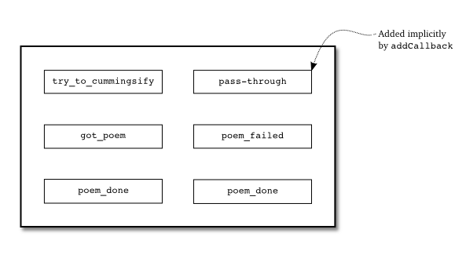
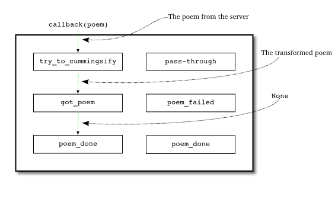
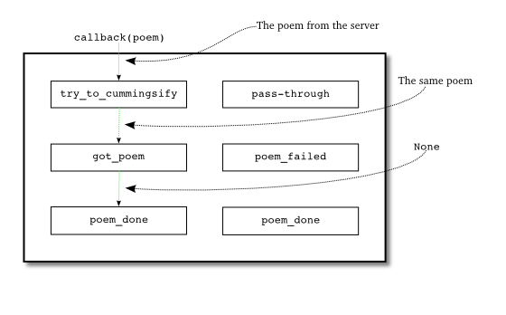
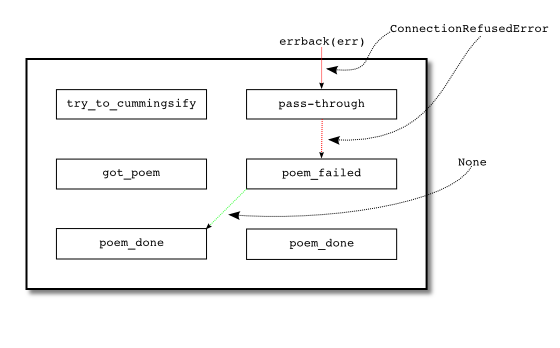
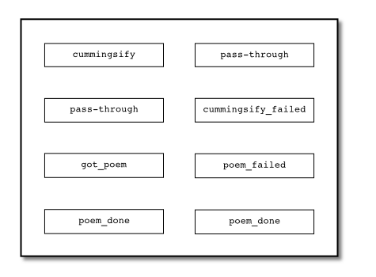

### 版本5.0

现在我们将要向诗歌下载客户端添加一些新的处理逻辑，包括在第九部分提到要添加的功能。不过，首先我要说明一点：我并不知道如何实现Byronification引擎。那超出了我的编程能力范围。取而代之的，我想实现一个简单的功能，即Cummingsifier。其只是将诗歌内容转换成小写字母：
```python
def cummingsify(poem)
    return poem.lower()
```
这个方法如此之简单以至于它永远不会出错。版本5.0的实现代码在[twisted-client-5/get-poetry.py](http://github.com/jdavisp3/twisted-intro/blob/master/twisted-client-5/get-poetry.py#L1)文件中。我们使用了修改后的 cummingsify，其会随机地选择以下行为：

1. 返回诗歌的小写版本
2. 抛出一个GibberishError异常
3. 抛出一个ValueError

这样，我们便模拟出来一个会因为各种意料不到的问题而执行失败的复杂算法。其它部分的仅有的改变在方法poetry_main中：
```python
def poetry_main():
    addresses = parse_args()
    from twisted.internet import reactor
    poems = []
    errors = []
    def try_to_cummingsify(poem):
        try:
            return cummingsify(poem)
        except GibberishError:
            raise
        except:
            print 'Cummingsify failed!'
            return poem
    def got_poem(poem):
        print poem
        poems.append(poem)
    def poem_failed(err):
        print >>sys.stderr, 'The poem download failed.'
        errors.append(err)
    def poem_done(_):
        if len(poems) + len(errors) == len(addresses):
            reactor.stop()
    for address in addresses:
        host, port = address
        d = get_poetry(host, port)
        d.addCallback(try_to_cummingsify)
        d.addCallbacks(got_poem, poem_failed)
        d.addBoth(poem_done)
    reactor.run()
```
因此，当从服务器上下载一首诗歌时，可能会出现如下情况：

1. 打印诗歌的小写版本
2. 打印"Cummingsify failed"并附上原始形式的诗歌
3. 打印"The peom download failed"。

为了实现下面内容的效果，你可以打开多个服务器或打开一个服务器多次，直到你观察到所有不同的结果，当然也尝试一下去连接一个没有服务器值守的端口。

图19是我们给deferred添加回调后形成的callback/errback链：

<center></center>
<center>图19 deferred中的回调链</center>

注意到，"pass-throug"errback通过addCallback添加到链中。它会将任何其接收到的Failure传递给下一个errback（即poem_failed函数）。因此poem_failed函数可以处理来自get_poetry与try_to_commingsify两者的failure。下面让我们来分析下deferred可能会出现的激活情况，图20说明了我们能够下载到诗歌并且try_to_commingsify成功执行的路线图：

<center></center>
<center>图20 成功下载到诗歌并且成功变换其格式</center>

在这种情况中，没有回调执行失败，因此控制权一直在callback中流动。注意到poem_done收到的结果是None，这是因为它并没有返回任何值。如果我们想让后续的回调都能触及到诗歌内容，只要显式地让got_poem返回诗歌即可。

图21说明了我们在成功下载到诗歌后，但在try_to_cummingsify中抛出了GibberishError：

<center></center>
<center>图21 成功下载到诗歌但出现了GibberishError</center>

由于try_to_cummingsify回调抛出了GibberishError，所以控制权转移到了errback链，即poem_fail回调被调用并传入的捕获的异常作为其参数。

由于poem_failed并没有抛出获异常或返回一个Failure，因此在它执行完后，控制权又回到了callback链中。如果我们想让poem_fail完全处理好传进来的错误，那么返回一个None是再好不过的做法了。相反，如果我们只想让poem_failed采取一部分行动，但继续传递这个错误，那么我们需要改写poem_failed，即将参数err作为返回值返回。如此一来，控制权交给了下一个errback回调。

注意到，迄今为止，got_poem与poem_failed都不可能出现执行失败的情况，因此errback链上的poem_done是不可能被激活的。但在任何情况下这样做都是安全的，这体现了"防御式"编程的思想。比如在got_poem或poem_failed出现了bugs，那么这样做就不会让这些bugs的影响进入Twisted的核心代码区。鉴于上面的描述，可以看出addBoth类似于try/except中的finally语句。

下面我们再来看看第三种可能情况，即成功下载到诗歌但try_to_cummingsify抛出了VauleError，如图22：

<center></center>
<center>图22 成功下载到诗歌当cummingsify执行失败</center>

除了got_poem得到是原始式样的诗歌而不是小写版的外，与图20描述的情况完全相同。当然，控制权还是在try_to_cummingsif中进行了转移，即使用了try/except捕获了ValueError并返回了原始式样的诗歌。而这一切deferred并不知晓。

最后，我们来看看当试图连接一个无服务器值守的端口会出现什么情况，如图23所示：

<center></center>
<center>图23 连接服务器失败</center>

由于poem_failed返回了一个None，因此控权又回到了callback链中。

### 版本5.1

在版本5.0中我们使用普通的try/except来捕获try_to_cummingsify中的异常，而没有让deferred来捕获这个异常。这其实并没有什么错误，但下面我们将采取一种新的方式来处理异常。

设想一下，我们让deferred来捕获 GibberishError 与ValueError 异常，并将其传递到errback链中进行处理。如果要保留原有的行为，那么需要下面的errback来判断错误类型是否为Valuerror，如果是，那么返回原始式样的诗歌，这样一来，控制权再次回到callback链中并将原始式样的诗歌打印出来。

但有一个问题：errback并不会得到原始诗歌内容 。它只会得到由cummingsify抛出的vauleError异常。为了让errback处理这个错误，我们需要重新设计它来接收到原始式样的诗歌。

一种方法是改变cummingsify以让异常信息中包含原始式样的诗歌。这也正是我们在5.1版本中做的，其代码实现在[twisted-client-5/get-poetry-1.py](http://github.com/jdavisp3/twisted-intro/blob/master/twisted-client-5/get-poetry-1.py)中。我们改写ValueError异常为CannotCummingsify异常，其能将诗歌作为其第一个参数来传递。

如果cummingsify是外部模块中一个真实存在的函数，那么其最好是通过另一个函数来捕获非GibberishError并抛出一个CannotCummingsify异常。这样，我们的poetry_main就成为：
```python
def poetry_main():
    addresses = parse_args()
    from twisted.internet import reactor
    poems = []
    errors = []
    def cummingsify_failed(err):
        if err.check(CannotCummingsify):
            print 'Cummingsify failed!'
            return err.value.args[0]
        return err
    def got_poem(poem):
        print poem
        poems.append(poem)
    def poem_failed(err):
        print >>sys.stderr, 'The poem download failed.'
        errors.append(err)
    def poem_done(_):
        if len(poems) + len(errors) == len(addresses):
            reactor.stop()
    for address in addresses:
        host, port = address
        d = get_poetry(host, port)
        d.addCallback(cummingsify)
        d.addErrback(cummingsify_failed)
        d.addCallbacks(got_poem, poem_failed)
        d.addBoth(poem_done)
```
而新的deferred结构如图24所示：

<center></center>
<center>图24 版本5.1的deferrd调用链结构</center>

来看看cummingsify_failed的errback回调：
```python
def cummingsify_failed(err):
    if err.check(CannotCummingsify):
        print 'Cummingsify failed!'
        return err.value.args[0]
    return err
```
我们使用了Failure中的check方法来确认嵌入在Failure中的异常是否是CannotCummingsify的实例。如果是，我们返回异常的第一个参数（即原始式样诗歌）。因此，这样一来返回值就不是一个Failure了，控制权也就又回到callback链中了。否则（即异常不是CannotCummingsify的实例），我们返回一个Failure，即将错误传递到下一个errback中。

图25说明了当我们捕获一个CannotCummingsify时的调用过程：

<center></center>
<center>图25 捕获一个CannotCummingsify异常</center>

因此，当我们使用deferrd时，可以选择使用try/except来捕获异常，也可以让deferred来将异常传递到errback回调链中进行处理。

### 总结

在这个部分，我们增强了客户端的Deferred的功能，实现了异常与结果在callback/errback链中"路由"。（你可以将各个回调看作成路由器，然后根据传入参数的情况来决定其返回值进入下一个stage的哪条链，或者说控制权进入下一个stage的哪个类型的回调）。虽然示例程序是虚构出来的，但它揭示了控制权在deferred的回调链中交错传递具体方向依赖于返回值的类型。

那我们是不是已经对deferred无所不知了？不，我们还会在下面的部分继续讲解deferred的更多的功能。但在第十一部分，我们先不讲这部分内容，而是实现我们的Twisted版本的诗歌下载服务器。

### 参考

本部分原作参见: dave @ <http://krondo.com/?p=1956>

本部分翻译内容参见杨晓伟的博客 <http://blog.sina.com.cn/s/blog_704b6af70100q87q.html>
