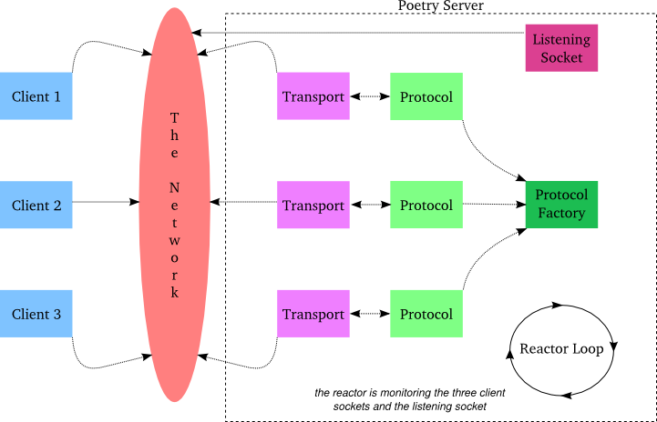

### 诗歌下载服务器

到目前为止，我们已经学习了大量关于诗歌下载客户端的Twisted的知识，接下来，我们使用Twisted重新实现我们的服务器端。得益于Twisted的抽象机制，接下来你会发现我们前面已经几乎学习到了所需的全部知识。其实现源码在[twisted-server-1/fastpoetry.py](http://github.com/jdavisp3/twisted-intro/blob/master/twisted-server-1/fastpoetry.py#L1)中。之所以称其为fastpoetry是因为其传输诗歌并没有任何延迟。注意到，其代码量比客户端代码少多了。

让我们一部分一部分地来看服务端的实现，首先是poetryProtocol：
```python
class PoetryProtocol(Protocol):
    def connectionMade(self):
        self.transport.write(self.factory.poem)
        self.transport.loseConnection()
```
如同客户端的实现，服务器端使用Protocol来管理连接（在这里，连接是由客户端发起的）。这里的Protocol实现了我们的诗歌下载逻辑的服务器端。由于我们协议逻辑处理的是单向的，服务器端的Protocol只负责发送数据。如果你访问服务器端，协议请求服务器在连接建立后立即发送诗歌，因此我实现了connectionMade方法，其会在Protocol创建一个连接后被激活执行。

这个方法告诉Transport做两件事：将整首诗歌发送出去然后关闭连接。当然，这两个动作都是同步操作。因此调用write函数也可以说成“一定要将整首诗歌发送到客户端”，调用loseConnection意味着“一旦将要求下载的诗歌发送完毕就关掉这个连接”。

也许你看到了，Protocol是从Factory中获得诗歌内容的：
```python
class PoetryFactory(ServerFactory):
    protocol = PoetryProtocol
    def __init__(self, poem):
        self.poem = poem
```
这么简单！除了创建PoetryProtocol, 工厂仅有的工作是存储要发送的诗歌。

注意到我们继承了ServerFactory而不是ClientFactory。这是因为服务器是要被动地监听连接状态而不是像客户端一样去主动的创建。我们何以如此肯定呢？因为我们使用了listenTCP方法，其描述文档声明factory参数必须是ServerFactory类型的。

我们在main函数中调用了listenTCP函数：
```python
def main():
    options, poetry_file = parse_args()
    poem = open(poetry_file).read()
    factory = PoetryFactory(poem)
    from twisted.internet import reactor
    port = reactor.listenTCP(options.port or 0, factory,nterface=options.iface)
    print 'Serving %s on %s.' % (poetry_file, port.getHost())
    reactor.run()
```
其做了三件事：

1. 读取我们将要发送的诗歌
2. 创建PoetryFactory并传入这首诗歌
3. 使用listenTCP来让Twisted监听指定的端口，并使用我们提供的factory来为每个连接创建一个protocol

剩下的工作就是reactor来运转事件循环了。你可以使用前面任何一个客户端来测试这个服务器。

### 讨论

回忆下第五部分中的图8与图9.这两张图说明了Twisted建立一个连接后如何创建一个协议并初始化它的。其实对于Twisted在其监听的端口处监听到一个连接之后的整个处理机制也是如此。这也是为什么connectTCP与listenTCP都需要一个factory参数的原因。

我们在图9中没有展示的是，connectionMake也会在Protocol初始化的时候被调用。无论在哪儿都一样（Dave是想说，connectionMade都会在Protocol初始化时被调用），只是我们在客户端处没有使用这个方法。并且我们在客户端的portocal中实现的方法也没有在服务器中用到。因此，如果我们有这个需要，可以创建一个共享的PoetryProtocol供客户端与服务器端同事使用。这种方式在Twisted经常见到。例如，[NetstringReceiver protocol](http://twistedmatrix.com/trac/browser/tags/releases/twisted-8.2.0/twisted/protocols/basic.py#L31)即能从连接中读也能向连接总写[netstrings](http://en.wikipedia.org/wiki/Netstrings)。

我们略去了从低层实现服务器端的工作，但我们可以来思考一下这里做了些什么。首先，调用listenTCP来告诉Twisted创建一个 [listening socket](http://en.wikipedia.org/wiki/Berkeley_sockets#listen.28.29) 并将其添加到事件循环中。在 listening socket 有事件发生并不意味有数据要读，而是说明有客户端在等待连接自己。

Twisted会自动接受连接请求，并创建一个新的客户端连接来连接客户端与服务器（中间桥梁）。这个新的连接也要加入事件循环中，并且Twisted会为其创建了一个Transport和一个专门为这个连接服务的PoetryProtocol。因此，Protocol实例总是连接到client socket，而不是listening socket。

我们可以在图26中形象地看到这一结果：
 
<center></center>
<center>图26 服务器端的网络连接</center>

在图中，有三个客户端连接到服务器。每个Transport代表一个client socket，加上listening socket总共是四个被select循环监听的文件描述符（file descriptor).当一个客户端断开与其相关的transport的连接时，对应的PoetryProtocol也会被解引用并当作垃圾被回收。而PoetryFactory只要我们还在监听新的连接就会一直不停地工作（即PoetryFactory不会随着一个连接的断开导致的PoetryProtocol的销毁而销毁）。

如果我们提供的诗歌很短的话，那么这些client socket与其相关的各种对象的生命期也就很短。但也有可能会是一台相当繁忙的服务器以至于同时有千百个客户端同时请求较长的诗歌。那没关系，因为Twisted并没有连接建立的限制。当然，当下载量持续的增加，在某个结点处，你会发现已经到达了OS的上限。对于那些高下载量的服务器，仔细的检测与测试是每天都必须要做的工作。

并且Twisted在监听端口的数量上亦无限制。实际上，一个单一的Twisted线程可以监听数个端口并为其提供不同的服务（通过使用不同的factory作为listenTCP的参数即可）。如果经过精心的设计，甚至可以推迟到部署阶段来决定"是使用一个Twisted进程来提供多个服务还是使用多个Twisted进程来实现?"。

我们这个版本的服务器有些功能是没有的。首先，它无法产生任何日志来帮助我们调试和分析网络出现的问题。其次，服务器也不是做为一个守护进程来运行的，按下`ctrl+c`或者退出登陆都会使其中止执行。后面章节我们会解决这两个问题，但是第十二部分我们先来完成另一个改进版的服务器。

### 参考

本部分原作参见: dave @ <http://krondo.com/?p=2048>

本部分翻译内容参见杨晓伟的博客 <http://blog.sina.com.cn/s/blog_704b6af70100q97x.html>
