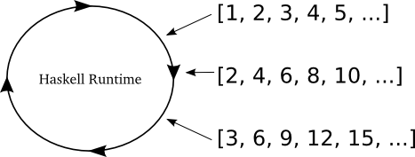

### 简介

在上一个部分我们对比了Twisted与 [Erlang](http://www.erlang.org/),并将注意力集中在它们共有的一些思想上.结果表明使用Erlang也是非常简便的,因为异步I/O和响应式编程是Erlang运行时和进程模型的关键元素.

今天我们想走得更远一点,去看一看 [Haskell](http://haskell.org/haskellwiki/Haskell) —— 另一种功能性语言,然而与Erlang有很大不同(当然与Python也不同).这里面没有太多的平行概念,但我们仍然会发现藏在下面的异步I/O概念.

### F —— 函数式

虽然Erlang是函数式语言,它主要关注可靠的并发模型.Haskell,另一方面,是彻头彻尾函数式的,它无耻地利用了范畴论的概念,如 [函子](http://en.wikipedia.org/wiki/Functor) 和 [单子](http://en.wikipedia.org/wiki/Monad_%28category_theory%29).

不要慌.我们这里不会涉及那些复杂的东西(虽然我们可以).相反,我们将关注一个Haskell的更加传统的功能特性:惰性. 像许多函数式语言一样(除了Erlang), Haskell支持 [惰性计算](http://en.wikipedia.org/wiki/Lazy_evaluation). 在懒惰计算语言中,程序的文字并不过多的描述怎样计算需要计算的东西.具体实施计算的细节一般留给了编译器和运行时系统.

同时,需要进一步指出,作为惰性计算推进的运行时可能一次只计算表达式的一部分(惰性的)而不是全部.一般地,运行时只提供维持当前计算继续所需的最小计算量.

这里有一个使用Haskell `head` 语句的简单例子,这是一个提取列表第一个元素的函数,对于列表[1,2,3](Haskell与Python共享一些列表句法):
```
head [1,2,3]
```
如果你安装了GHC Haskell运行时,你可以自己试一试:
```
[~] ghci
GHCi, version 6.12.1: http://www.haskell.org/ghc/  : ? for help
Loading package ghc-prim ... linking ... done.
Loading package integer-gmp ... linking ... done.
Loading package base ... linking ... done.
Prelude> head [1,2,3]
1
Prelude>
```
结果是 `1`, 正如所料.

Haskell列表的语法包含从前几个元素定义列表的使用功能.例如,列表[2,4,..]是从2开始的偶数序列.到哪结束呢?实际上并不会结束.Haskell列表[2,4,..]和其他如此表述的都是(概念上)无限列表.你可以在交互式Haskell提示符下计算它,这将试图打印这个表达式的结果如下:
```
Prelude> [2,4 ..]
[2,4,6,8,10,12,14,16,18,20,22,24,26,28,30,32,34,36,38,40,42,44,46,48,50,52,54,56,58,60,62,64,66,68,70,72,74,76,78,80,82,84,86,88,90,92,94,96,98,100,102,104,106,108,110,112,114,116,118,120,122,124,126,128,130,132,134,136,138,140,142,144,146,
...
```
你不得不按 `Ctrl-C` 终止计算，因为它自己不会停下来.但由于是惰性计算,在Haskell中应用无限列表是没有问题的:
```
Prelude> head [2,4 ..]
2
Prelude> head (tail [2,4 ..])
4
Prelude> head (tail (tail [2,4 ..]))
6
```
这里我们分别获取无限列表的第一、二、三个元素,没看到任何无限循环.这就是惰性计算的本质.Haskell运行时只构造完成 `head` 函数所需的列表,而不是先构造整个列表(这将导致无限循环),再将整个列表传递给 `head`.这个列表的其余部分跟本没有被构造,因为它们对继续推进计算毫无意义.

当我们引入 `tail` 函数时,Haskell被迫进一步构造列表,但是又一次仅仅构造了满足下一次计算所需的列表.同时,一旦计算结束,列表(未完成的)被丢弃了.

这里是一些部分计算无限列表的Haskell代码：
```
Prelude> let x = [1..]
Prelude> let y = [2,4 ..]
Prelude> let z = [3,6 ..]
Prelude> head (tail (tail (zip3 x y z)))
(3,6,9)
```
`zip` 函数将所有列表压缩在一起,之后抓取尾部的尾部的头部.又一次,Haskell没有发生任何问题,仅仅构造了计算所需的列表.我们可以将Haskell运行时"消耗"这些无限列表的过程可视化：

<center></center>
<center>图46 Haskell消耗一些无限列表</center>

虽然我们将Haskell运行时画为一个简单的循环,它可能被多线程实现(并且很可能如果你使用GHC版本的Haskell).但这幅图的关键点在于它十分像一个 `reactor` 循环,消耗从网络套接字传来的数据片段.

你可以把异步I/O和 `reactor` 模式视为一种有限形式的惰性计算.异步I/O的格言是:"仅仅推进你所拥有的数据".同时惰性计算的格言是:"仅仅推进你所需的数据".进一步,一个惰性计算语言在任何地方都使用这个格言,并不仅仅是有限范围的I/O.

但关键点在于,对于惰性计算语言,做异步I/O小菜一碟. 编译器和运行时已经被设计为一点一点地处理数据结构,因而惰性地处理到来的I/O数据流是标准问题. 如此Haskell运行时,就像Erlang运行时,简单地集成异步I/O为套接字抽象的一部分. 我们以实现一个Haskell诗歌客户端来展示这个概念.

### Haskell 诗歌

我们第一个Haskell诗歌客户端位于 [haskell-client-1/get-poetry.hs](https://github.com/jdavisp3/twisted-intro/blob/master/haskell-client-1/get-poetry.hs). 同Erlang一样,我们直接给出了完成版的客户端,如果你希望学习更多,我们列出进一步阅读的参考.

Haskell同样支持轻量级线程或进程,尽管它们不是Haskell的核心,我们的Haskell客户端为每首需要下载的诗歌创建一个进程.关键函数是 [runTask](https://github.com/jdavisp3/twisted-intro/blob/master/haskell-client-1/get-poetry.hs#L64),它连接到一个套接字并且以轻量级线程启动 [getPoetry](https://github.com/jdavisp3/twisted-intro/blob/master/haskell-client-1/get-poetry.hs#L48) 函数.

在这个代码中,你将看到许多类型定义. Haskell,不像Python和Erlang,是静态类型的.我们没有为每个变量定义类型，因为Haskell可以自动地推断没有显示定义的变量(或者报告错误如果不能推断).许多函数包含IO类型(技术上叫单子)，因为Haskell要求我们将有副作用的代码从纯函数中干净地分离(如,执行I/O的代码).

`getPoetry` 函数包含如下行:
```
poem <- hGetContents h
```
看起来像从句柄一次读入整首诗(如TCP套接字).但是Haskell,像往常一样,是惰性的.Haskell运行时包含一个或更多实际线程,它们在一个选择循环中执行异步I/O,如此便保存了惰性处理I/O流的可能性.

仅仅为说明异步I/O正在进行,我们引入一个"回调"函数, [gotLine](https://github.com/jdavisp3/twisted-intro/blob/master/haskell-client-1/get-poetry.hs#L60),它为诗歌的每一行打印一些任务信息.但这不是一个真正的回调函数,无论我们用不用它程序都会使用异步I/O.甚至叫它"gotLine"反映了一个必要的语言思维,它是Haskell程序外的一部分.无论怎样,我们将一点点清扫它,先使Haskell客户端运转起来.

启动一些慢诗歌服务器:
```
python blocking-server/slowpoetry.py --port 10001 poetry/fascination.txt
python blocking-server/slowpoetry.py --port 10002 poetry/science.txt
python blocking-server/slowpoetry.py --port 10003 poetry/ecstasy.txt --num-bytes 30
```
现在编译Haskell客户端:
```
cd haskell-client-1/
ghc --make get-poetry.hs
```
这将创建一个二进制 `get-poetry`.最后,针对我们的服务器运行客户端:
```
/get-poetry 10001 10002 1000
```
你将看到如下输出:
```
Task 3: got 12 bytes of poetry from localhost:10003
Task 3: got 1 bytes of poetry from localhost:10003
Task 3: got 30 bytes of poetry from localhost:10003
Task 2: got 20 bytes of poetry from localhost:10002
Task 3: got 44 bytes of poetry from localhost:10003
Task 2: got 1 bytes of poetry from localhost:10002
Task 3: got 29 bytes of poetry from localhost:10003
Task 1: got 36 bytes of poetry from localhost:10001
Task 1: got 1 bytes of poetry from localhost:10001
...
```
输出与前一个异步客户端有点不同,因为我们只打印一行而不是任意块的数据.但你可以清楚地看到,客户端是从所有服务器同时处理数据,而不是一个接一个.你同样可以注意到客户端立即打印第一首完成的诗,不等其他还在继续处理的诗.

好了,让我们清除还剩下的一点讨厌东西并且发布一个仅仅抓取诗歌而不介意任务序号的新版本.它位于 [haskell-client-2/get-poetry.hs](https://github.com/jdavisp3/twisted-intro/blob/master/haskell-client-2/get-poetry.hs). 注意它短多了,对于每个服务器,仅仅连接到套接字,抓取所有数据,之后将其发送回去.

OK,让我们编译新的客户端：
```
cd haskell-client-2/
ghc --make get-poetry.hs
```
针对相同的诗歌服务器组运行它:
```
./get-poetry 10001 10002 10003
```
最终,你将看到屏幕上出现每首诗的文字.

注意到每个服务器同时向客户端发送数据.更重要的,客户端以最快速度打印出第一首诗的每一行,而不去等待其余的诗,甚至当它正在处理其它两首诗.之后它快速地打印出之前积累的第二首诗.

同时这所有发生的一切都不需要我们做什么.这里没有回调,没有传来传去的消息,仅仅是一个关于我们希望程序做什么的简洁地描述,而且很少需要告诉它应该怎样做.其余的事情都是由Haskell编译器和运行时处理的.漂亮!

### 讨论与进一步阅读

从Twisted到Erlang之后到Haskell,我们可以看到一个平行的移动,从前景到背景逐步深入异步编程背后的思想.在Twisted中,异步编程是其存在的核心激励理念. Twisted实现作为一个与Python分离的框架(Python缺乏核心的异步抽象如轻量级线程),当你用Twisted写程序时，将异步模型置于首位与核心.

在Erlang中,异步对于程序员仍然是可见的,但细节成为语言材料的一部分和运行时系统,形成一个抽象使得异步消息在同步进程之间交换.

最后,在Haskell中,异步I/O仅仅是运行时中的另一个技术,大部分对于程序员是不可见的,因为提供惰性计算是Haskell的中心理念.

对于以上情况,我们还没有介绍任何深邃的思想.我们仅仅指出许多有趣的异步模型出现的地方,这种模型可以被多种方式表达.

如果这些激起你对Haskell的兴趣,那么我们推荐"[Real World Haskell](http://www.amazon.com/exec/obidos/ASIN/0596514980/krondonet-20)"继续你的学习.这本书是介绍语言学习的典范.

虽然我没有读过它,我却听说到它饱受"[Learn You a Haskell](http://learnyouahaskell.com/)"的赞誉.

完成了本系列的倒数第二部分，现在到了结束探索Twisted之外异步系统的时刻. 在 第二十二节 中,我们将做一个总结,以及推荐一些学习Twisted的方法.

### 建议练习(献给令人吃惊的狂热者)

1. 互相对比Twisted,Erlang和Haskell客户端.
2. 修改Haskell客户端来处理连接诗歌服务器的失败,以便它们能够下载所有的能够下载的诗歌并为那些不能下载的诗歌输出合理的错误消息.
3. 写Haskell版本的对应Twisted中的诗歌服务器.

### 参考

本部分原作参见: dave @ <http://krondo.com/blog/?p=2814>

本部分翻译内容参见luocheng @ <https://github.com/luocheng/twisted-intro-cn/blob/master/p21.rst>
